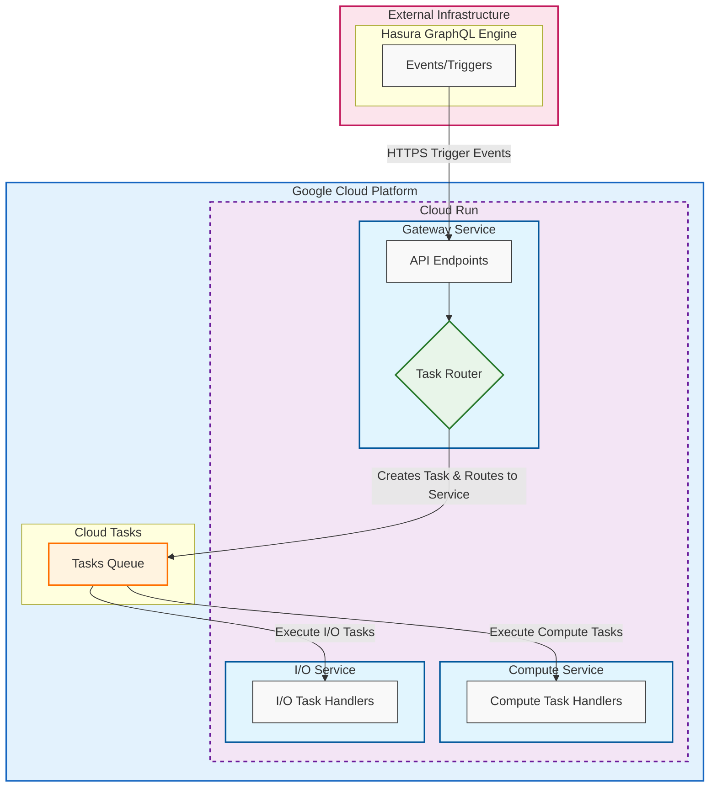

# Go live

## Architecture

```mermaid
flowchart TB
    %% Define External Infrastructure
    subgraph External["External Infrastructure"]
        subgraph Hasura["Hasura GraphQL Engine"]
            HE[Events/Triggers]
        end
    end

    %% Define GCP Infrastructure
    subgraph GCP["Google Cloud Platform"]
        subgraph CloudRun["Cloud Run"]
            subgraph GW["Gateway Service"]
                API[API Endpoints]
                TaskRouter{Task Router}
            end
            
            subgraph CS["Compute Service"]
                CH[Compute Task Handlers]
            end
            
            subgraph IO["I/O Service"]
                IOH[I/O Task Handlers]
            end
        end

        subgraph CT["Cloud Tasks"]
            CTQ[Tasks Queue]
        end
    end

    %% Connections
    HE -->|HTTPS Trigger Events| API
    API --> TaskRouter
    TaskRouter -->|Creates Task & Routes to Service| CTQ
    CTQ -->|Execute Compute Tasks| CH
    CTQ -->|Execute I/O Tasks| IOH

    %% Styling
    classDef default fill:#f9f9f9,stroke:#333,stroke-width:1px
    classDef service fill:#e1f5fe,stroke:#01579b,stroke-width:2px
    classDef queue fill:#fff3e0,stroke:#ff6f00,stroke-width:2px
    classDef router fill:#e8f5e9,stroke:#2e7d32,stroke-width:2px
    classDef cloudrun fill:#f3e5f5,stroke:#6a1b9a,stroke-width:2px,stroke-dasharray: 5 5
    classDef external fill:#fce4ec,stroke:#c2185b,stroke-width:2px
    classDef gcp fill:#e3f2fd,stroke:#1565c0,stroke-width:2px
    
    class GW,CS,IO service
    class CTQ queue
    class TaskRouter router
    class CloudRun cloudrun
    class External external
    class GCP gcp
```
